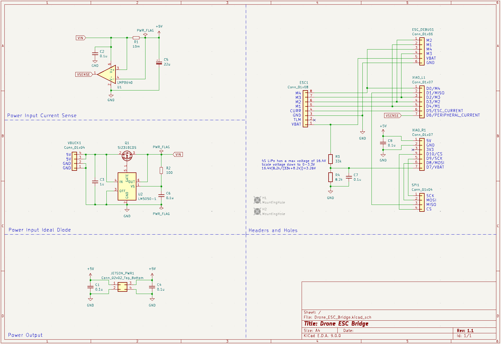

# Drone_ESC_Bridge
## Description
This board is intended to act as a bridge between the Nvidia Jetson and the 4-in-1 ESC on the ADP drone[^1]

It recieves motor speeds and other commands from the Jetson over the SPI interface and outputs motor speeds to the ESC over PWM

It also monitors the LiPo voltage and can report it back to the Jetson over the SPI interface

The board receives 5V power from an off-board buck converter which is used to power both the microcontroller (Seeed XIAO SAMD21) and the Jetson

[^1]: Firmware for the Jetson and Seeed XIAO can be found [here](https://github.com/LarsGart/Autonomous-Drone-Platform)
## Images
### Schematic

### Top Layer

### Bottom Layer

### 3D Top View

